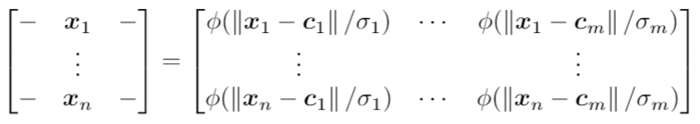
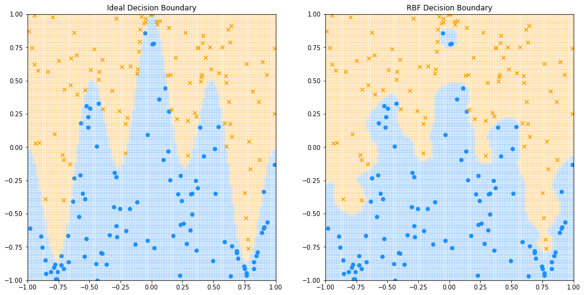

# PyTorch Radial Basis Function (RBF) Layer

An implementation of an RBF layer/module using PyTorch. RBF layers are an alternative to the activation
functions used in regular artificial neural networks. Typically, each RBF layer in an RBF network is
followed by a linear layer. In an RBF layer, the distances between the input and a number of positions
called centres are calculated and scaled. Then an RBF is applied to each scaled distance. i.e,

  

where the x's are the inputs, phi is a radial basis function, the sigmas are the scaling factors
and the c's are the centres. Usually, the centre positions are found by clustering the data. This
is impractical for RBF networks with many RBF layers. In this implementation, the centres and scaling
factors are trained with gradient descent, which allows for RBF networks with many RBF layers.

## Features

* A radial basis function (RBF) layer
* A handful of radial basis functions
* Centres and scaling factors trained by gradient descent rather than clustering

## Demonstration

In the demonstration, an RBF network is used to learn a decision boundary for a toy classification
problem.

  

